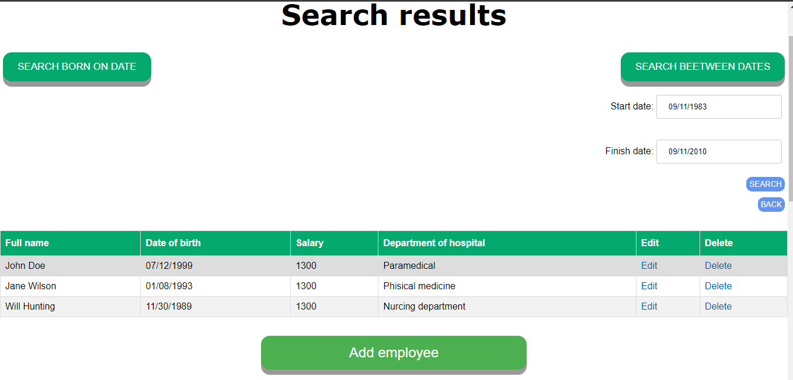

# Department app
Department app is a web application which uses
RESTful web service to record the information about departments
and their employees

Application should provide:
- Storing departments and employees in a database
- Display the list of departments and the average salary (calculated automatically) for these departments
- Update the list of departments (add, edit, delete a department)
- Display the list of employees
- Update the list of employees (add, edit, delete an employee)
- Search employees born on a certain date
- Search employees born on a certain date range

## 1. Homepage
The homepage of the app contains a brief description 
of the app and a button to start the work

*Main scenario:*

- User opens a site
- The homepage is displayed

Pic. 1.1 The homepage
## 2. Login page
- User press login url and go to form to authentificate

Pic 2.1 Login page
The form contains:
  - Admin's username
  - Password 

 When the password is correct then user redirects to home page and edit/delete/add functions are available. Else there is an error

If user is not admin and tries to go to logun required page there 401 error

Pic 2.2 Unauthorized page

- User selects the profile page
- Application displays the profile main info page

Pic 2.2 Profile page

*Main scenario:*
- User clicks the "Select file" to download avatar of proifle in .png format
- User clicks the "Upload" to put avatar
- User clicks "Logout" to logout from profile page
- User clicks "Change or add department" to change department
- User clicks "Change or add e,ployees" to change employees

## 3. Departments
### 3.1 Display the list of departments

*Main scenario:*

- User selects the department option of the menu or type URL
- Application displays the list of departments if user is not authentificated and list of departments with edit/delete/add fucntions when user is admin

Pic 3.1.1 The departments page

The list displays following columns:
- Name, the unique name of department
- Short description of the department
- Employees, the number of employees in each of departments
- Average salary, the average salary of the department, calculated
automatically by summing all the salaries of employees of the department
and dividing the sum by employee count

*When no departments have been added scenario:*
- User presses the add button on the department page
or enter correct url

Pic 3.1.2 The departments page when no departments were added

### 3.2 Add department
*Main scenario:*

- User clicks the "Add department" button on departments page
- Application displays a form to enter department data
- User enters department data and presses "Submit" button
- The record is added to database
- If an error occurs, the error message is displayed
- If a new department record is successfully added, then list of departments
 with added record and a alert message is displayed
 - Can't add the same department
  
 
 *Cancel operation scenario:*
 - User clicks the "Add department" button on departments page
- Application displays a form to enter department data
- User enters department data and selects the menu option "Home",
"Departments" or "Employees"
- The data is not saved to the database and the corresponding page 
is displayed

Pic. 3.3. Add department is successfull

When adding a department, the following details are entered:

- The name of the department
- The description

Pic. 3.4. Add department page

### 3.3 Edit department
*Main scenario:*
- User clicks the "Edit" button on departments page
- Application displays a form to enter department data, the 
current department data is predefined in the form
- User enters department data and presses "Submit" button
- The record is added to database
- If an error occurs, the error message is displayed
- If a new department record is successfully edited, then list of departments
 with added record and a alert message is displayed
 
 *Cancel operation scenario:*
- User clicks the "Edit" button on departments page
- Application displays a form to enter department data, the 
current department data is predefined in the form
- User enters department data and selects the menu option "Home",
"Departments" or "Employees"
- The data is not saved to the database and the corresponding page 
is displayed

Pic. 3.5. Edit department is successfull

When editing a department, the following details are entered:

- The name of the department
- The description

Pic. 3.6. Edit department
### 3.4 Delete department

*Main scenario:*
- User clicks the "Delete" button on departments page
- The record is deleted from the database
- The updated list of departments

Pic. 3.4. All departments are deleted

## 4. Employees
### 4.1 Display the list of employees

*Main scenario:*

- User selects the employees option of the menu
- Application displays the list of employees

Pic 4.1.1 The employees page

The list displays following columns:
- Name, the name of the employee
- Salary, the employee's salary
- Date of birth, the employee's date of birth
- Department, the name of the department related to the employee

*When no employees have been added scenario:*
- User selects the employees option of the menu
- Application displays the text which states that no employees
have been found

Pic 4.1.2 The employees page when no employees were added

*Search employees born on certain date scenario:*

- User selects the employees option of the menu
- Application displays the list of employees
- User enter the date to search employees born on that
date
- User clicks search button
- Application updates the employee list with search results

Pic 4.1.3 Born on date

*Search employees born on certain date range scenario:*

- User selects the employees option of the menu
- Application displays the list of employees
- User enter the start date and the end date
 to search employees born on that date range
- User clicks search button
- Application updates the employee list with search results

Pic 4.1.4 Born beetween dates

### 4.2 Add employee
*Main scenario:*

- User clicks the "Add employee" button on employees page
- Application displays a form to enter employee data
- User enters employee data and presses "Submit" button
- The record is added to database
- If an error occurs, the error message is displayed
- If a new employee record is successfully added, then list of departments
 with added record and a alert message is displayed
 

Pic. 4.1. Add employee is successfull 

 *Cancel operation scenario:*
 - User clicks the "Add employee" button on employees page
- Application displays a form to enter employee data
- User enters employee data and selects the menu option "Homepage",
"Departments" or "Employees"
- The data is not saved to the database and the corresponding page 
is displayed

Pic. 4.2. Add employee page

When adding an employee, the following details are entered:

- The name of the employee
- The name of the department related to employee
- The date of birth of the employee
- The salary of the employee

### 4.3 Edit employee
*Main scenario:*
- User clicks the "Edit" button on employees page
- Application displays a form to enter employee data, the 
current employee data is predefined in the form
- User enters employee data and presses "Submit" button
- The record is added to database
- If an error occurs, the error message is displayed
- If a new employee record is successfully edited, then list of departments
 with added record and a alert message is displayed
 

Pic. 4.3. Edit employee is successfully

 *Cancel operation scenario:*
- User clicks the "Edit" button on employees page
- Application displays a form to enter employee data, the 
current employee data is predefined in the form
- User enters employee data and selects the menu option "Home",
"Departments" or "Employees"
- The data is not saved to the database and the corresponding page 
is displayed

Pic. 4.4. Edit employee page

When editing an employee, the following details are entered:

- The name of the employee
- The date of birth of the employee
- The salary of the employee
- The name of the department related to employee

### 4.4 Delete employee

*Main scenario:*
- User clicks the "Delete" button on employees page
- The record is deleted from the database
- The updated list of employees and a alert message
is displayed

Pic. 4.5. Deleted employees